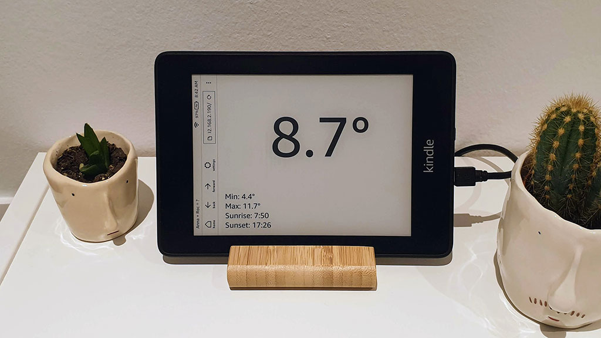

# Kindle weather station
A weather station for your Kindle

## How to install it?

Well, as the Kindle e-Readers don't support native apps or things like that, the only thing we can do is to open a web with the Experimental Browser and to the best we can with it. So the project is just a web page that you have to edit with your own values, publish it somewhere and access it with the Kindle's browser.

Here's a list with the steps to achieve it:

1. Sign up to [OpenWeather](https://openweathermap.org) and get your own API token
2. Pass the timezone where you live to `int`, knowing that `UTC+1` will be just `1`, `UTC-7` will be `-7` and so on
3. Replace the four `{values}` by your own ones in this URL: `https://fewlaps.com/weather/index.html?lat={lat}&lon={lon}&token={token}&timezone={timezone}`
4. Type in `~ds` in your Kindle's main screen search box to disable the screensaver
5. Open the Kindle's Experimental Browser and access the URL you just edited
6. Enjoy!
7. Extra, extra! Take a picture and send it to [@rocboronat](http://twitter.com/rocboronat)! 😍
